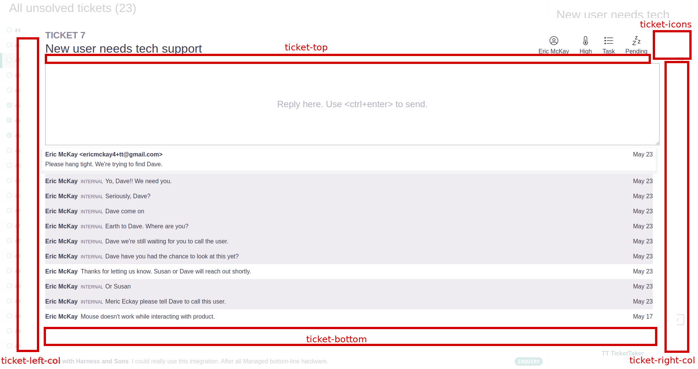

# TicketTaker Extension Framework

**NOTE**: This is an early draft of our plugin API. Everything is subject to change as the product matures.

The TicketTaker Integration Framework allows developers to extend TicketTaker functionality.

### Overview

Plugins can be added nearly everywhere in the application:

Plugins receive an exhaustive feed of events from the application. Plugins can respond when a user opens a ticket, when a user comments on a ticket, or when dozens of other events occur.

Developers publish Javascript files that are executed on the end-user's browser via `<script>` tags.

These files invoke `window.registerPlugin(mountPoint: string, component: React.ReactNode)` with two parameters:

1. `mountPoint` - A `string` that describes where in the application the plugin should be mounted.
2. `component` - A React component that receives data about the application through `props`

