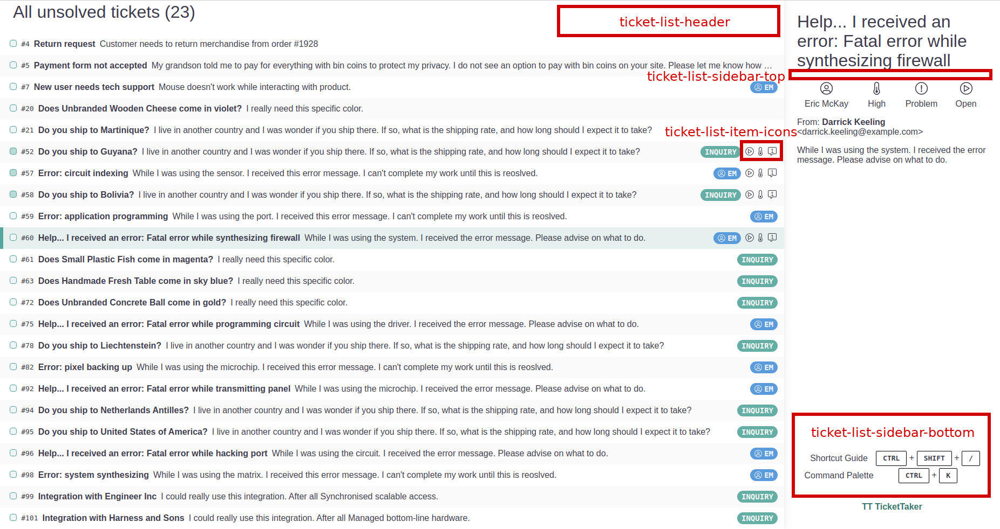
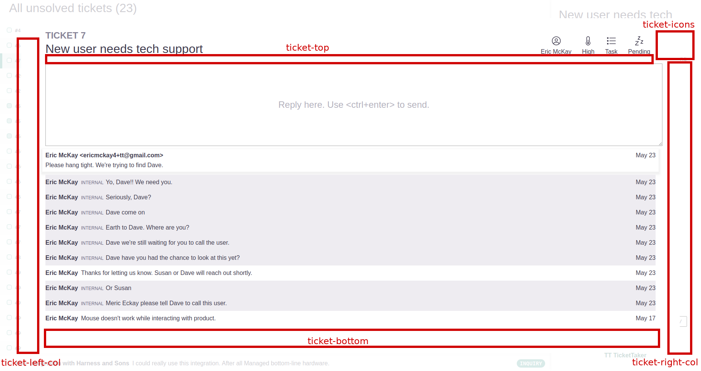

# mountPoint

The following is a list of possible values for the `mountPoint` argument of `window.registerPlugin`. These values describe where in the application the `component` returned by the plugin will be mounted.

Note: Multiple plugins can be mounted at the same locations. In this case, they will be rendered according to the order in which they invoked `window.registerPlugin`

* `root` - At the root of the application. Modals should use this mount point.

#### Ticket List View

* `ticket-list-header` - At the top right of the Ticket List View. Useful for icons or notifications.
* `ticket-list-item-icons` - At the end of the list of icons shown when a ticket in the Ticket List view is focused or selected.
* `ticket-list-sidebar-top` - Under the header of the sidebar shown on the Ticket List view
* `ticket-list-sidebar-bottom` - Under all other content in the sidebar shown on the Ticket List view

#### Ticket View

* `ticket-icons` - At the end of the icons in the top right of the Ticket View
* `ticket-top` - Between the header and the new comment input field of the Ticket View
* `ticket-bottom` - Below all comments shown on Ticket View. \(likely off screen unless scrolled to\)
* `ticket-left-col` - Adds a column to the left of the comments on the Ticket View
* `ticket-right-col` - Adds a column to the right of the comments on the Ticket View

